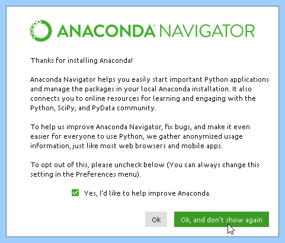
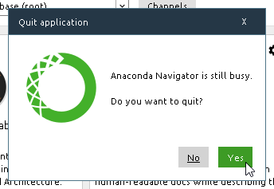

# Anaconda 開発環境構築手順

Windows10 Anaconda Python

## インストール

科学技術計算に特化した開発プラットフォーム。Pythonをはじめとした色々な開発環境がひとまとめに構築できる。

現時点(2020/1/30)ではバージョンが2と3と2種類存在するのはPythonのバージョンとリンクしているため。

Anaconda2でインストールするとPython2の最新バージョンが、Anaconda3でインストールするとPython3の最新バージョンがインストールされる。Python2のアップデートはされないのでよほどの理由がない限りはAnaconda3でインストールを行う。

以降はAnaconda3でインストールする手順となる。

### Anaconda

ブラウザ起動

https://www.anaconda.com/distribution/

過去バージョンが欲しい場合

https://repo.continuum.io/archive/

最新バージョンをクリックしダウンロード

Anaconda3-2019.10-Windows-x86_64.exe

 Setup.png)

Welcome to Anaconda3 2019.10

(64-bit) Setup

Setup will guide you through the installation of Anaconda3 2019.10 (64-bit).

セットアップは、Anaconda3 2019.10（64ビット）のインストールをガイドします。

It is recommended that you close all other applications before starting Setup.

セットアップを開始する前に、他のすべてのアプリケーションを閉じることをお勧めします。

This will make it possible to update relevant system files without having to reboot your computer.

これにより、コンピューターを再起動することなく、関連するシステムファイルを更新できます。

Click Next to continue.

次へをクリックして続行します。

Next

 Setup.png)

License Agreement

ライセンス契約

Please review the license terms before installing Anaconda3 2019.10(64-bit).

Anaconda3 2019.10（64-bit）をインストールする前に、ライセンス条項を確認してください。

If you accept the terms of the agreement, click I Agree to continue.

契約条件に同意する場合は、[同意する]をクリックして続行します。

You must accept the agreement to install Anaconda3 2019.10(64-bit).

Anaconda3 2019.10（64-bit）をインストールするには、契約に同意する必要があります。

I Agree

同意する

 Setup.png)

Select Installation Type

インストールタイプの選択

Please select the type of installation you would like to perform for Anaconda3 2019.10(64-bit).

Anaconda3 2019.10（64-bit）で実行するインストールのタイプを選択してください。

Install for:

インストール対象：

Just Me (recommended)

Just Me（推奨）

All Users (requires admin privileges)

すべてのユーザー（管理者権限が必要）

Next

 Setup-1580347379017.png)

Choose Install Location

インストール場所を選択

Choose the folder in which to install Anaconda3 2019.10(64-bit).

Anaconda3 2019.10（64-bit）をインストールするフォルダーを選択します。

Setup will install Anaconda3 2019.10(64-bit) in the fillowing folder.

セットアップにより、Anaconda3 2019.10（64-bit）がfillowingフォルダーにインストールされます。

To install in a different folder, click Browse and select another folder.

別のフォルダーにインストールするには、「参照」をクリックして別のフォルダーを選択します。

Click Next to continue.

次へをクリックして続行します。

Destination Folder

移動先フォルダ

C:\Users\tani\Anaconda3

Space required

必要なスペース

Space available

利用可能なスペース

Next

 Setup.png)

Advanced Installation Options

高度なインストールオプション

Customize how Anaconda integrates with Windows

AnacondaとWindowsの統合方法をカスタマイズする

Advanced Options

高度なオプション

Add Anaconda to my PATH environment variable

AnacondaをPATH環境変数に追加します

Not recommended,

推奨されません、

Instead, open Anaconda with the Windows Start menu and select "Anaconda (64-bit)".

代わりに、Windowsの[スタート]メニューでAnacondaを開き、[Anaconda（64-bit）]を選択します。

This "add to PATH" option makes Anaconda get found before previously installed software, but may cause problems requiring you to uninstall and reinstall Anaconda.

この「PATHに追加」オプションにより、以前にインストールされたソフトウェアの前にAnacondaが検出されますが、Anacondaのアンインストールと再インストールが必要になる問題が発生する場合があります。

Register Anaconda as my default Python 3.7

AnacondaをデフォルトのPython 3.7として登録します

This will allow other programs, such as Python Tools for Visual Studio PyCharm, Wing IDE, PyDev, and MSI binary packages, to autmatically detect Anaconda as the primary Python 3.7 on the system.

これにより、Visual Studio PyCharm、Wing IDE、PyDev、MSIバイナリパッケージ用のPythonツールなどの他のプログラムが、システム上のプライマリPython 3.7としてAnacondaを自動的に検出できるようになります。

既にPython3.7がインストールされていると出る。

 Setup.png)

A version of Python 3.7 (64-bit) is already at

Python 3.7（64ビット）のバージョンはすでに

C:\Users\tani\AppData\Local\Programs\Python\Python37\

We recommend that if you want Anaconda registered as your system Python, you unregister thes Python first.

AnacondaをシステムPythonとして登録する場合は、最初にPythonの登録を解除することをお勧めします。

If you really know this is what you want, click OK, otherwise click cancel to continue.

これが必要なものであることが本当にわかっている場合は、[OK]をクリックします。それ以外の場合は、[キャンセル]をクリックして続行します。

NOTE: Anaconda 1.3 and earlier lacked and uninstall, if you are upgrading an old Anaconda, Please delete the directory manually.

注：古いAnacondaをアップグレードする場合は、Anaconda 1.3以前は欠けていたためアンインストールします。ディレクトリを手動で削除してください。

Install

 Setup.png)

Installation Complete

インストールが完了

Setup was completed successfully.

セットアップは正常に完了しました。

Completed

完成しました

Next

 Setup.png)

Anaconda3 2019.10(64-bit)

Anaconda + JetBrains

Anaconda and JetBrains are working together to bring you Anaconda-Powered environments tightly integrated in the PyCharm IDE.

AnacondaとJetBrainsは協力して、PyCharm IDEに緊密に統合されたAnaconda-Powered環境を提供します。

PyCharm for Anaconda is available at:

PyCharm for Anacondaは次の場所から入手できます。

https://www.anaconda.com/pycharm

Next

 Setup.png)

Thanks for installing Anaconda3!

Anaconda3をインストールしていただきありがとうございます！

Anaconda is the most popular Python data science platform.

Anacondaは、最も人気のあるPythonデータサイエンスプラットフォームです。

Share your notebooks, packages, projects and environments on Anaconda Cloud!

Anaconda Cloudでノートブック、パッケージ、プロジェクト、環境を共有しましょう！

Learn more about Anaconda Cloud

Anaconda Cloudの詳細

Learn how to get started with Anaconda

Anacondaの使用開始方法を学ぶ

Finish

## 初期動作

### Anaconda Navigator

Anaconda Navigator helps you easily start important Python applications and manage the packages in your local Anaconda installation.
Anaconda Navigatorを使えば、重要なPythonアプリケーションを簡単に起動して、あなたのローカルのAnacondaインストールでパッケージを管理することができます。

It also connects you to online resources for learning and engaging with the Python, SciPy, and PyData community.
また、Python、SciPy、およびPyDataの各コミュニティを学び、参加するためのオンラインリソースにもつながっています。

To help us improve Anaconda navigator, fix bugs, and manke it even easier for everyone to use Python we gather anonymized usage information, just like most web browsers and mobile apps.
私たちがAnacondaのナビゲーターを改良し、バグを修正し、そして誰もがPythonを使うのをさらに簡単にするために、私たちはほとんどのウェブブラウザやモバイルアプリのように匿名の使用情報を集めます。

To opt out of this, please uncheck below(you can always change this setting in the preferences menu).
これをオプトアウトするには、下のチェックを外してください（あなたは常に設定メニューでこの設定を変更することができます）。

yes, i'd like to help improve Anaconda.
はい、私はAnacondaを改善したいのですが。

Ok, and don't show again

OK、また表示しない

Quit application

アプリケーションを終了

Anaconda Navigator is still busy.

Anaconda Navigatorはまだ忙しいです。

Do you want to quit?

終了しますか？

Yes

