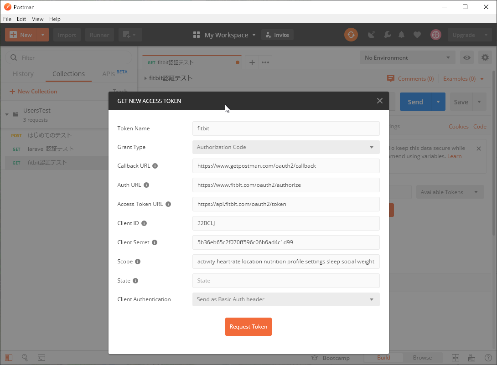

# Fitbit 開発環境構築

Windows10 Fitbit OS Simulator

## インストール

### アカウント作成

アカウント作成必須。

後述するエミュレーターやAPIを動作させるのに必ず必要。

### アプリケーション作成

公開するアプリケーションの枠を作成する。

https://dev.fitbit.com/

Manage -> Register An App を選択する。

Register an application

アプリケーションを登録する

Application Name *

アプリケーション名

Description *

全角でも10文字必要。

説明

Application Website *

アプリケーションWebサイト

Organization *

会社

Organization Website *

組織のウェブサイト

Terms Of Service Url *

利用規約のURL

Privacy Policy Url *

プライバシーポリシーのURL

OAuth 2.0 Application Type *

OAuth 2.0アプリケーションタイプ

「Personal」 を選択する。より詳細な情報が取得できる。

Callback URL *

コールバックURL

Default Access Type *

「https://www.getpostman.com/oauth2/callback」と入力する。最後にスラッシュを付けない。

デフォルトのアクセスタイプ

Add a subscriber

加入者を追加する

I have read and agree to the terms of service

利用規約を読み、同意します

Edit Application Settings

アプリケーション設定の編集

Delete Application

アプリケーションの削除

Reset Client Secret

クライアントシークレットのリセット

Revoke Client Access Tokens

クライアントアクセストークンの取り消し

OAuth 2.0 Client ID

Client Secret

Callback URL

OAuth 2.0: Authorization URI

認証URI

OAuth 2.0: Access/Refresh Token Request URI

トークンリクエストURIへのアクセス/更新

参考

[https://qiita.com/makopo/items/7f5a47a7c58929b6fb93#1-oauth%E8%AA%8D%E8%A8%BC%E6%83%85%E5%A0%B1%E3%82%92%E4%BD%9C%E6%88%90](https://qiita.com/makopo/items/7f5a47a7c58929b6fb93#1-oauth認証情報を作成)

https://dev.fitbit.com/build/reference/web-api/basics/

### Fitbit Windowsアプリ版

### Fitbit OS Simulator

Fitbitシミュレーター。実機に乗せる前にデバッグ用途で動作確認できる。

https://dev.fitbit.com/getting-started/#using-the-simulator

Fitbit OS Simulator-latest-0.7.4.exe

ダブルクリックしてすぐにアカウント認証が求められる。

参考

https://dev.fitbit.com/getting-started/#using-the-simulator

https://www.jonki.net/entry/2018/07/19/001525

### fitbit studio

Web上でログインして使用する。ローカルPC上でのインストールは不要だが、英語なので翻訳可能なGoogle Chromeで閲覧したほうが良い。

https://studio.fitbit.com/

また、普段は使用しない。

### Postman

## シミュレーター説明

英語版しかないので、和訳を記載する。

設定内容を保存しないので、起動するたびに変えていく必要あり。

### Apps

No applications are installed

アプリケーションがインストールされていません

### Sensors

センサー

Heart Rate

心拍数 

60がデフォルト

Body Presence

ボディプレゼンス

On-wrist

手首（デフォルト）

Location

ロケーション

ドイツのミュンヘンがデフォルト

### Power + Display

電源 + 表示

Display

Onがデフォルト

Power

Battery Level

バッテリー容量

100%がデフォルト

Charging state

充電状態

Disconnected

切断されました（デフォルト）

Connected

接続済み

Charging

充電中

### User

Clock display time

時計の表示時間

24 hour がデフォルト

Start week on

週初め

Mondayがデフォルト

Language

言語

en-US(English) がデフォルト

Japaneseも選択可能

### Setting

Device bridge is waiting for a debugger

デバイスブリッジはデバッガを待っています

Companion bridge is waiting for a debugger

コンパニオンブリッジはデバッガを待っています

Device type

デバイスタイプ

以下から選択可能。変更すると左ペインのディスプレイ画像が変わる。

lonic

Versa

Versa Lite

## 認証テスト

### Postman

fitbit認証テスト

Token Name

トークン名

Grant Type

助成金の種類

Callback URL

コールバックURL

This is the callback URL that you will be redirected to, after your application is authorized.

Postman uses this to extract the authorization code or access token.

The callback URL should match the one you use during the application registration process.

これは、アプリケーションが承認された後にリダイレクトされるコールバックURLです。

Postmanはこれを使用して、認証コードまたはアクセストークンを抽出します。

コールバックURLは、アプリケーションの登録プロセス中に使用するURLと一致する必要があります。

Auth URL

認証URL

The endpoint for authorization server.

This is used to get the authorization code.

許可サーバーのエンドポイント。

これは認証コードを取得するために使用されます。

Access Token URL

アクセストークンURL

The endpoint for authentication server.

This is used to exchange the authorization code for an access token.

認証サーバーのエンドポイント。

これは、アクセストークンの認証コードを交換するために使用されます。

Client ID

クライアントID

The client identifier issued to the client during the Application registration process.

アプリケーション登録プロセス中にクライアントに発行されたクライアント識別子。

Client Secret

クライアントシークレット

The client secret issued to the client during the Application registration process.

アプリケーション登録プロセス中にクライアントに発行されたクライアントシークレット。

Scope

範囲

The scope of the access request.

lt may have multiple space-delimited values.

アクセス要求の範囲。

ltには、スペースで区切られた複数の値が含まれる場合があります。

State

状態

An opaque value that is used for preventing cross-site request forgery.

クロスサイトリクエスト強要を防止するために使用される不透明な値。

Client Authentication

クライアント認証

Send as Basic Auth header

基本認証ヘッダーとして送信

Send client credentials in body

本体でクライアント資格情報を送信する

ログイン

### 期限切れかユーザー変更時の再取得

Access token expired と出るとき

ログイン画面が出るのでログインする

## API仕様

参考

https://dev.fitbit.com/build/reference/

| 日本語                           | 英語                        | 範囲      | 説明                                                         |
| -------------------------------- | --------------------------- | --------- | ------------------------------------------------------------ |
| 睡眠状態                         | sleep                       | sleep     | 睡眠範囲には、睡眠ログと関連する睡眠分析が含まれます         |
| Fitbitのデバイスおよび設定       | Fitbit devices and settings | settings  | 設定範囲には、ユーザーアカウントと、アラームなどのデバイス設定が含まれます |
| プロフィール                     | profile                     | profile   | プロファイルスコープは基本的なユーザー情報です               |
| 心拍数                           | heart rate                  | heartrate | 心拍数範囲には、連続心拍数データと関連分析が含まれます       |
| 場所とGPS                        | location and GPS            | location  | ロケーションスコープには、GPSおよびその他のロケーションデータが含まれます。 |
| アクティビティおよびエクササイズ | activity and exercise       | activity  | 活動範囲には、活動データと、歩数、距離、消費カロリー、活動時間などの運動ログ関連機能が含まれます |
| 友達                             | friends                     | social    | ソーシャルスコープには、友達リスト、招待状、リーダーボードなどの友達関連の機能が含まれます |
| 体重                             | weight                      | weight    | 体重範囲には、体重、および体格指数、体脂肪率、目標などの関連情報が含まれます |
| 食品および水分の記録             | food and water logs         | nutrition | 栄養の範囲には、カロリー消費と、食物/水のロギング、目標、計画などの栄養関連機能が含まれます |

https://dev.fitbit.com/build/reference/web-api/oauth2/

### アクティビティ

最初に使い始めた日から今までの統計を出す

GET https://api.fitbit.com/1/user/-/activities.json

{

​    "lifetime": {

​        "total": {

​            "activeScore": -1,

​            "caloriesOut": -1,

​            "distance": 0,

​            "steps": 0

​        },

​        "tracker": {

​            "activeScore": -1,

​            "caloriesOut": -1,

​            "distance": 0,

​            "steps": 0

​        }

​    }

}

active Score 活動時間（秒？）
calories Out 消費カロリー
distance 距離
steps 歩数

今日（日付毎）の統計を出す

更に以下の情報が取得できる

目標、各状態活動時間、休憩時間

GET https://api.fitbit.com/1/user/-/activities/date/today.json

GET https://api.fitbit.com/1/user/-/activities/date/2019-10-30.json

GET https://api.fitbit.com/1/user/22BC4R/activities/date/2019-10-30.json 

{

​    "activities": [

​        {

​            "activityId": 90009,

​            "activityParentId": 90009,

​            "activityParentName": "Run",

​            "calories": 3,

​            "description": "Running - 5 mph (12 min/mile)",

​            "distance": 0.006211,

​            "duration": 223000,

​            "hasStartTime": true,

​            "isFavorite": false,

​            "lastModified": "2019-10-30T03:14:52.000Z",

​            "logId": 26383827447,

​            "name": "Run",

​            "startDate": "2019-10-30",

​            "startTime": "12:11",

​            "steps": 0

​        }

​    ],

​    "goals": {

​        "activeMinutes": 30,

​        "caloriesOut": 2024,

​        "distance": 8.05,

​        "steps": 10000

​    },

​    "summary": {

​        "activeScore": -1,

​        "activityCalories": 3,

​        "caloriesBMR": 1606,

​        "caloriesOut": 1608,

​        "distances": [

​            {

​                "activity": "Run",

​                "distance": 0.006211

​            },

​            {

​                "activity": "total",

​                "distance": 0.02

​            },

​            {

​                "activity": "tracker",

​                "distance": 0.02

​            },

​            {

​                "activity": "loggedActivities",

​                "distance": 0.006211

​            },

​            {

​                "activity": "veryActive",

​                "distance": 0

​            },

​            {

​                "activity": "moderatelyActive",

​                "distance": 0

​            },

​            {

​                "activity": "lightlyActive",

​                "distance": 0.02

​            },

​            {

​                "activity": "sedentaryActive",

​                "distance": 0.01

​            }

​        ],

​        "fairlyActiveMinutes": 0,

​        "lightlyActiveMinutes": 1,

​        "marginalCalories": 1,

​        "sedentaryMinutes": 1439,

​        "steps": 26,

​        "veryActiveMinutes": 0

​    }

}

goals 目標

calories BMR 基礎代謝

active Minutes 活動時間

marginal Calories 限界カロリー

sedentary Minutes 休憩時間

歩数を取得

GET https://api.fitbit.com/1/user/22BC4R/activities/steps/date/2019-10-30.json 

