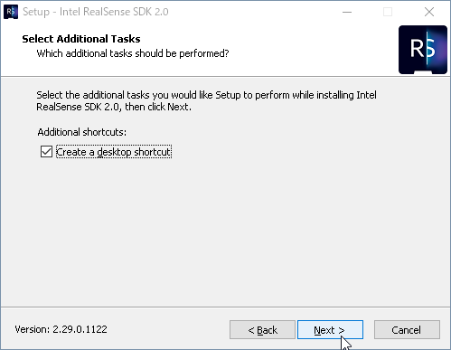

# Intel RealSense 開発環境構築

## インストール

### Visual Studio C++

### SDK

Intel.RealSense.SDK.exe

Welcome to the Intel RealSense SDK 2.0 version 2.29.0.1122 on your computer.

It is recommended that you close all other applications before continuing.

Click Next to continue, or Cancel to exit Setup.

コンピューターのIntel RealSense SDK 2.0バージョン2.29.0.1122へようこそ。

続行する前に、他のすべてのアプリケーションを閉じることをお勧めします。

[次へ]をクリックして続行するか、[キャンセル]をクリックしてセットアップを終了します。

Select Componets

Which components should be installed?

Select the components you want to install; clear the components you do not want to install.

Click Next when you are ready to continue.

Full installation

Current selection requires at least 878.7 MB of disk space.

コンポーネントの選択

どのコンポーネントをインストールする必要がありますか？

インストールするコンポーネントを選択します。インストールしたくないコンポーネントをクリアします。

続行する準備ができたら「次へ」をクリックします。

フルインストール

現在の選択には、少なくとも878.7 MBのディスク容量が必要です。

Select Additional Tasks

Which additional tasks should be performed?

Select the additional tasks you would like Setup to perform while installing Intel RealSense SDK 2.0, then click Next.

Additional shortcuts:

Create a desktop shortcut

追加のタスクを選択

どの追加タスクを実行する必要がありますか？

Intel RealSense SDK 2.0のインストール中にセットアップで実行する追加タスクを選択し、[次へ]をクリックします。

追加のショートカット：

デスクトップショートカットを作成する

Ready to Install

Setup is now ready to begin installing Intel RealSense SDK 2.0 on your computer.

Click Install to continue with the installation, or click Back if you want to review or change any settings.

インストールの準備

これで、Intel RealSense SDK 2.0のコンピューターへのインストールを開始する準備が整いました。

[インストール]をクリックしてインストールを続行するか、設定を確認または変更する場合は[戻る]をクリックします。

Completing the Intel RealSense SDK 2.0 Setup Wizard

Setup has finished installing Intel RealSense SDK 2.0 on your computer.

The application may be launched by selecting the installed shortcuts.

Click Finish to exit Setup.

Launch Intel RealSense Viewer

Intel RealSense SDK 2.0セットアップウィザードの完了

セットアップは、コンピューターへのIntel RealSense SDK 2.0のインストールを完了しました。

インストールされたショートカットを選択することにより、アプリケーションを起動できます。

[終了]をクリックしてセットアップを終了します。

Intel RealSense Viewerを起動します　チェックを外す

デスクトップにアイコンができるので起動

[ビルド]-[ソリューションのビルド]

出力ウィンドウを見て

失敗、が0なら正常終了

デフォルトのみでインストールすれば以下のパスへ成果物が出力される。

C:\Program Files (x86)\Intel RealSense SDK 2.0\samples\x64\Debug

### TortoiseGit

## 設定

### TortoiseGit

Git クローン(複製)

URL https://github.com/IntelRealSense/librealsense.git

### CMake

コマンドプロンプト起動

フォルダ移動

cd /d E:\github_work\tortoisegit\librealsense

フォルダ作成

mkdir build

フォルダ移動

cd build

ビルド実行

cmake .. -DBUILD_CSHARP_BINDINGS=ON -DBUILD_UNITY_BINDINGS=ON -DBUILD_SHARED_LIBS=ON -DDOTNET_VERSION_LIBRARY=3.5 -DCMAKE_GENERATOR_PLATFORM=x64

出力メッセージ

--

-- Building for: Visual Studio 16 2019
-- Selecting Windows SDK version 10.0.17763.0 to target Windows 10.0.18362.
-- The CXX compiler identification is MSVC 19.23.28106.4
-- The C compiler identification is MSVC 19.23.28106.4
-- Check for working CXX compiler: C:/Program Files (x86)/Microsoft Visual Studio/2019/Community/VC/Tools/MSVC/14.23.28105/bin/Hostx64/x64/cl.exe
-- Check for working CXX compiler: C:/Program Files (x86)/Microsoft Visual Studio/2019/Community/VC/Tools/MSVC/14.23.28105/bin/Hostx64/x64/cl.exe -- works
-- Detecting CXX compiler ABI info
-- Detecting CXX compiler ABI info - done
-- Detecting CXX compile features
-- Detecting CXX compile features - done
-- Check for working C compiler: C:/Program Files (x86)/Microsoft Visual Studio/2019/Community/VC/Tools/MSVC/14.23.28105/bin/Hostx64/x64/cl.exe
-- Check for working C compiler: C:/Program Files (x86)/Microsoft Visual Studio/2019/Community/VC/Tools/MSVC/14.23.28105/bin/Hostx64/x64/cl.exe -- works
-- Detecting C compiler ABI info
-- Detecting C compiler ABI info - done
-- Detecting C compile features
-- Detecting C compile features - done
-- Internet connection identified
-- Info: REALSENSE_VERSION_STRING=2.29.0
-- Performing Test COMPILER_SUPPORTS_CXX11
-- Performing Test COMPILER_SUPPORTS_CXX11 - Failed
-- Performing Test COMPILER_SUPPORTS_CXX0X
-- Performing Test COMPILER_SUPPORTS_CXX0X - Failed
-- Setting Windows configurations
-- using RS2_USE_WMF_BACKEND
-- The CSharp compiler identification is Microsoft unknown 9999
-- The CSharp compiler version is 9999
-- Check for working C# compiler: C:/Program Files (x86)/Microsoft Visual Studio/2019/Community/MSBuild/Current/Bin/Roslyn/csc.exe
-- Check for working C# compiler: C:/Program Files (x86)/Microsoft Visual Studio/2019/Community/MSBuild/Current/Bin/Roslyn/csc.exe -- works
E:\github_work\tortoisegit\librealsense\build\wrappers\unity <<===>> E:\github_work\tortoisegit\librealsense\wrappers\unity �̃V���{���b�N �����N���쐬����܂���
CMake Warning at wrappers/csharp/Intel.RealSense/CMakeLists.txt:57 (message):
  Couldn't locate Unity.exe

-- GLFW 3.3 not found; using internal version
-- Looking for pthread.h
-- Looking for pthread.h - not found
-- Found Threads: TRUE
-- Could NOT find Vulkan (missing: VULKAN_LIBRARY VULKAN_INCLUDE_DIR)
-- Using Win32 for window creation
-- Found OpenGL: opengl32
-- Could NOT find apriltag (missing: APRILTAG_INC APRILTAG_LIB)
-- Unable to find apriltag library, skipping pose-apriltag example
-- Building with TM2
-- Download TM2 firmware 0;"No error" for target-0.1.0.279.mvcmd
-- Download TM2 firmware 0;"No error" for central_app-2.0.19.271.bin
-- Download TM2 firmware 0;"No error" for central_bl-1.0.1.112.bin
-- libusb not found; using internal version (missing: LIBUSB_LIB LIBUSB_INC)
-- Fetching recommended firmwares:
-- D4XX_RC_VERSION: 5.11.15.0
-- D4XX_FW_VERSION: 5.11.15.0
-- SR3XX_FW_VERSION: 3.26.1.0
-- Download firmware 0;"No error" for D4XX_FW_Image-5.11.15.0.bin
-- Download firmware 0;"No error" for D4XX_RC_Image-5.11.15.0.bin
-- Download firmware 0;"No error" for SR3XX_FW_Image-3.26.1.0.bin
-- Configuring done
-- Generating done
-- Build files have been written to: E:/github_work/tortoisegit/librealsense/build

--

正常終了

複数バージョンのVisual Studioをインストールしているときは

一番最初の行の値を見る。

Building for: Visual Studio 16 2019

基本的には最新バージョンが採用される。

この後の項でそのバージョンのVisual Studioでソリューションファイルを開く。

先程作成したフォルダにプロジェクトファイルやフォルダが出力されていること

E:\github_work\tortoisegit\librealsense\build

### Visual Studio C++

ビルド実行

E:\github_work\tortoisegit\librealsense\build\wrappers\csharp\Intel.RealSense

Intel.RealSense.sln

右クリック-[プログラムを開く]-[Microsoft Visual Studio 2017]

※ここは2019が入っているならそちらが良いかも。CMakeを実行したときに2019でコンパイルしていると後のビルドで「v142のビルドツールが見つかりません」と出たら2019へ切り替える。

ソリューションエクスプローラーの[Library]-[realsense2]を右クリック-[リビルド]を実行

※ソリューションのビルドは長くなる上、失敗する。

出力ウィンドウにて以下のメッセージが出れば正常終了。

6>realsense2.vcxproj -> E:\github_work\tortoisegit\librealsense\build\Debug\realsense2d.dll
6>プロジェクト "realsense2.vcxproj" のビルドが終了しました。
========== すべてリビルド: 6 正常終了、0 失敗、0 スキップ ==========

出力ウィンドウにて以下のメッセージが出た時の対処

error MSB8020: v142 (プラットフォーム ツールセット = 'v142') のビルド ツールが見つかりません。v142 ビルド ツールを使用してビルドするには、v142 ビルド ツールをインストールしてください。または、[プロジェクト] メニューを選択するかソリューションを右クリックし [ソリューションの再ターゲット] を選択して、現在の Visual Studio Tools にアップグレードすることもできます。

原因

v142=Visual Studio 2019がインストールされている環境でCMakeを実行したため、ツールセットも2019で構築されている。Visual Studio 2019に切り替えて再実行するか、以下の方法でv142からv141を選択して再ビルドする。

ソリューション エクスプローラー にてアイコンが「++」となっている箇所を

右クリック-[プロパティ]

構成プロパティ-全般-プラットフォームツールセットが v142 になっているのを v141 へ変更する。

build\Debugフォルダ（デフォルトではDebug。Releaseを選択したらそのフォルダ）にて以下のファイルが出来ていること。

Intel.RealSensed.dll

realsense2d.dll

※他にファイルが出来ているが、Debugだとその用途に使用する作業ファイルなので消さないようにする。