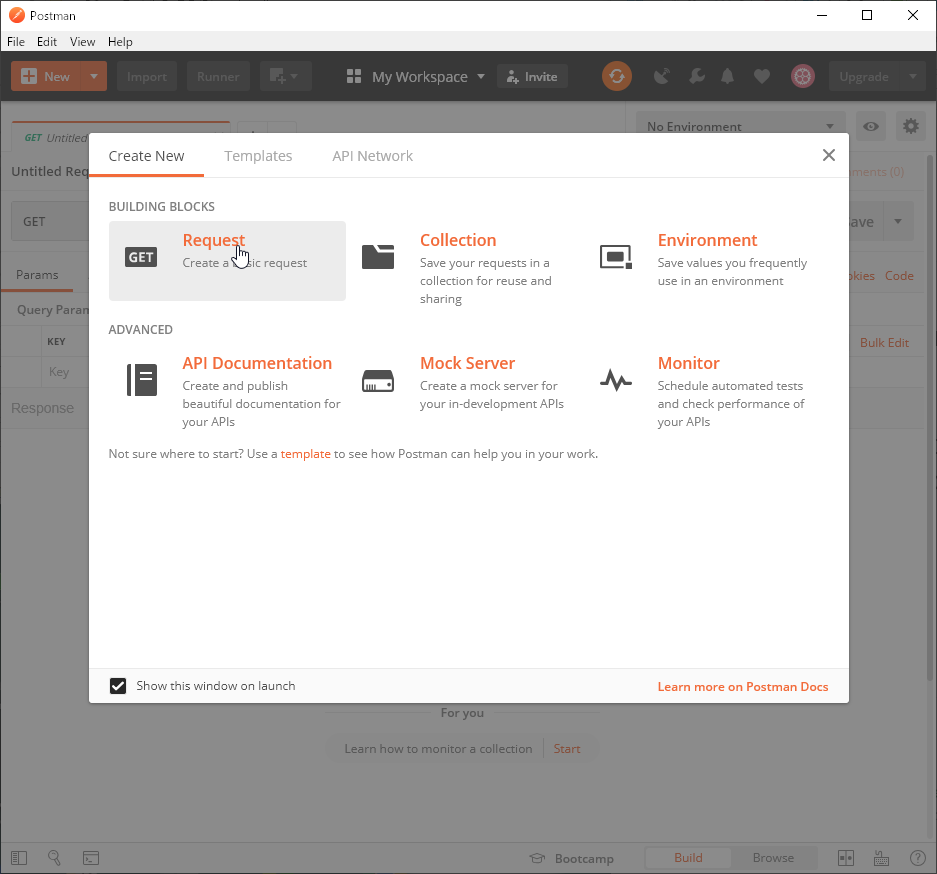

# Postmanの使い方

REST API のテストツール。

英語版しかないのでメッセージ翻訳も兼ねている。

参照

https://learning.getpostman.com/

## Start launcher

Create New

新しく作る

Templates

テンプレート

API Network

APIネットワーク

BUILDING BLOCKS

ビルディングブロック

Request

要求

Create a basic request

基本的なリクエストを作成する

Collection

コレクション

Save your requests in a collection for reuse and sharing

再利用と共有のために、リクエストをコレクションに保存します

Environment

環境

Save values you frequently use in an environment

環境で頻繁に使用する値を保存する

ADVANCED

高度な

API Documentation

APIドキュメント

Create and publish beautiful documentation for your APIs

APIの美しいドキュメントを作成して公開する

Mock Server

モックサーバー

Create a mock server for your in-development APIs

開発中のAPI用の模擬サーバーを作成する

Monitor

モニター

Schedule automated tests and check performance of your APIs

自動テストをスケジュールし、APIのパフォーマンスを確認します

Not sure where to start? Use a template to see how Postman can help you in your work.

どこから始めたらいいか分からない？テンプレートを使用して、Postmanが作業にどのように役立つかを確認してください。

Show this window on launch

起動時にこのウィンドウを表示する

Learn more on Postman Docs

Postman Docsの詳細

## Request

SAVE REQUEST

リクエストを保存

Requests in Postman are saved in collections (a group of requests).

Postmanのリクエストはコレクション（リクエストのグループ）に保存されます。

Learn more about creating collections

コレクションの作成の詳細

Request name

リクエスト名

Request description (Optional)

リクエストの説明（オプション）

Make things easier for your teammates with a complete request description.

完全なリクエストの説明を使用して、チームメイトの作業を容易にします。

Descriptions support Markdown

説明がMarkdownをサポート

Select a collection or folder to save to:

保存するコレクションまたはフォルダーを選択します。

Search for a collection of folder

フォルダーのコレクションを検索する

All Collections

すべてのコレクション

Create Collection

コレクションを作成

Cancel Save

保存をキャンセル