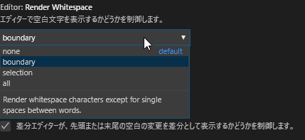

# Visual Studio Code 初期設定

Visual Studio Code をインストール直後にしておきたい設定を記載します。

## 拡張機能

Visual Studio Codeをインストールしたばかりですとテキストファイルの編集機能しかない状態です。拡張機能を追加で導入することでコーディングの効率化ができるようになります。

### Japanese Language Pack for Visual Studio Code

メニュー等のインターフェイスを英語から日本語へ変換します。以降の説明も日本語を適用したことが前提となります。導入後でも一部英語のままになっている箇所がありますので、都度和訳補完します。

左端にある□が4つあるアイコン（Extensions）をクリックします。

「japanese」と入力します。

「Japanese Language Pack for Visual Studio Code」をクリックします。

「install」をクリックします。「uninstall」に変わることを確認します。

Visual Studio Codeを終了し、再起動します。メニュー等が日本語に変わることを確認します。

## 基本設定

メニュー-[ファイル]-[基本設定]-[設定]

この設定は「ユーザー」「ワークスペース」「フォルダ」という階層ごとに設定可能です。上の階層「ユーザー」へ近づくほど設定範囲が広くなりますが、反比例して下の階層「フォルダ」よりも影響優先順位は低くなります。

階層の設定範囲は以下の通りです。

ユーザー：現在OSログイン中のOSユーザーフォルダの配下　例：C:\Users\\(ユーザー名)　/home/(ユーザー名)

ワークスペース：現在開いているワークスペースで定義されている複数フォルダそれぞれの配下

フォルダ：現在開いている単数フォルダの配下

例えば下の階層をデフォルトのままにしておけば「ユーザー」の設定のみが有効になります。逆にたとえ上の階層でどんな設定をしても「フォルダ」の設定が最優先されます。

この関係を踏まえておけば効率的な設定が可能となります。

設定項目が多くあり、項目自体を検索で抽出できます。

参考

https://blanche-toile.com/web/settings-visual-studio-code

### Editor:Render Whitespace

エディターで空白文字を表示するかどうかを制御します。

範囲 ユーザー

値 デフォルト none

変更値  all

補足

boundary

境界

Render whitespace characters except for single spaces between words.

単語間の単一スペースを除き、空白文字をレンダリングします。