# レンタルサーバー構築手順

Windows10 さくらインターネット CentOS 7 PHP Composer Laravel

## ローカルツールのインストール

### RLoginのインストール

### WinSCPのインストール

## サーバー購入

さくらインターネットで購入

### パケットフィルタ設定確認

[VPSコントロールパネル ログイン情報]
URL ：https://secure.sakura.ad.jp/vps/
IPアドレス：153.126.199.195

ログイン

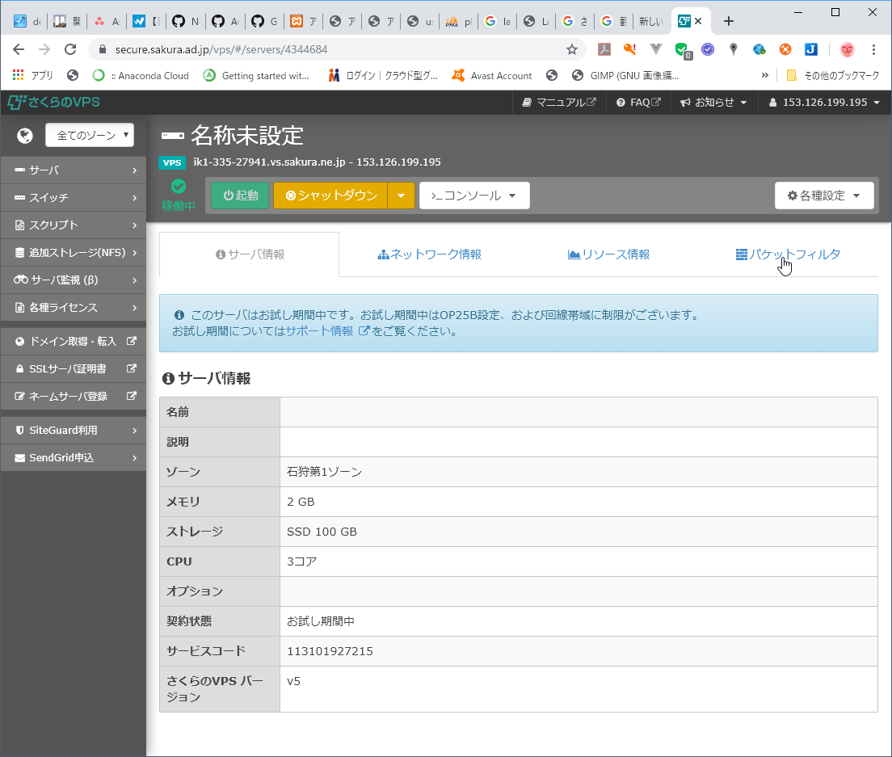

パケットフィルタ

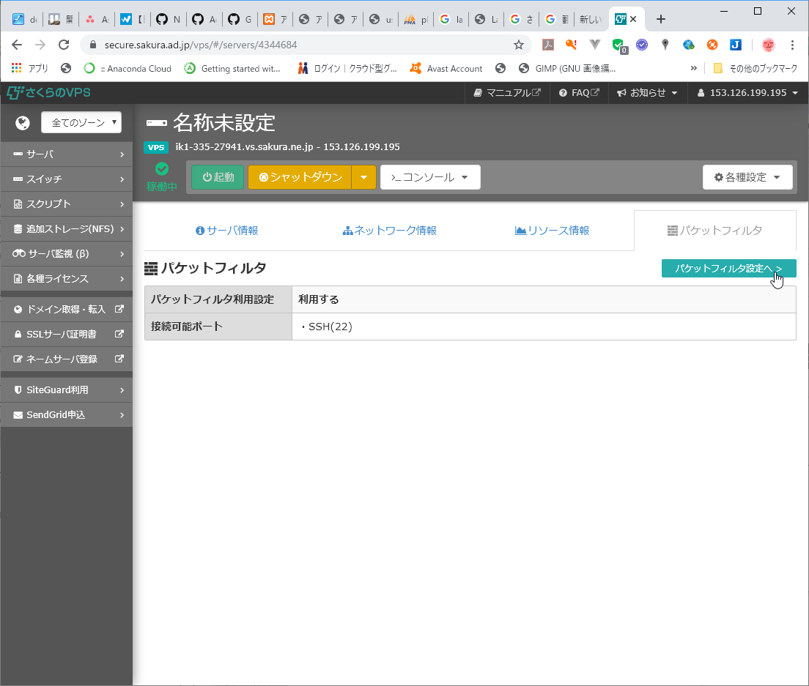

パケットフィルタ設定へ

 - さくらのVPSコントロールパネル.png)

SSHのみ有効になっていること

他のプロトコルのポート番号も確認する。

SSH
22
サーバにリモートログインするために利用します

Web
80/443
Webサーバにアクセスするために利用します

FTP
20/21
ファイルのアップロード/ダウンロードをするために利用します

メール
25/110/143/465/587/993/995
メールの送受信をするために利用します

逆にここに書かれているポート番号しか利用できないので、ポート番号を変更しないといけない場合、この設定を利用しないようにする。

## サーバー動作確認

[サーバ基本情報]
IPアドレス：153.126.199.195

[管理用ユーザ]
ユーザ名 ：root

### ログイン

RLoginを起動する。

rootで接続する。

プロンプトが#になること

OSバージョン確認

cat /etc/redhat-release

CentOS Linux release 7.6.1810 (Core)

uname -a

Linux ik1-335-27941.vs.sakura.ne.jp 3.10.0-957.10.1.el7.x86_64 #1 SMP Mon Mar 18 15:06:45 UTC 2019 x86_64 x86_64 x86_64 GNU/Linux

SELinux動作モード確認

getenforce

Disabled

ポート接続状況

ss -atn

ファイアーウォール確認

systemctl status firewalld

sshd確認

systemctl status sshd.service

## セキュリティ設定

### 開発用ユーザー作成

useradd sakura

passwd sakura

abridge2019

successfully と表示されること。

RLoginを起動する。

sakuraで接続する。

プロンプトが$になること。

### sudo 設定

su -

rootパスワードを入力

プロンプトが#になること

開発用ユーザーをsudoに追加

visudo

検索

/root

n

行コピペ

yy

p

i

以下の行に追加

root    ALL=(ALL)       ALL

sakura  ALL=(ALL)       ALL <-追加

保存

Esc

:

wq

ログアウト

exit

プロンプトが$になること

### アップデート

sudo yum update

y/nの入力が必要な時はyを入力する。

最後に Complete! とプロンプトが表示されること。

### 公開鍵生成

RLogin

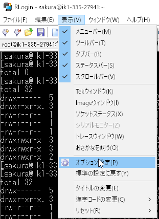

[表示]-[オプション設定]

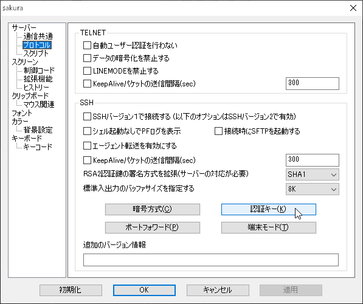

[サーバー]-[プロトコル]-[SSH]-[認証キー]

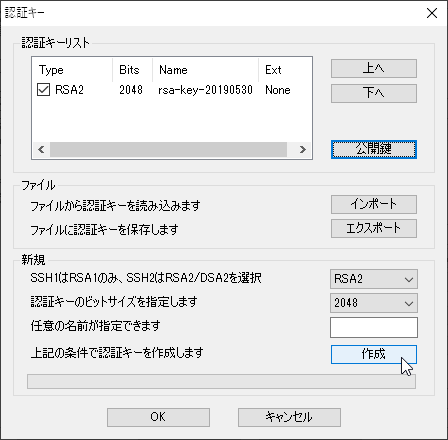

[新規]-[作成]

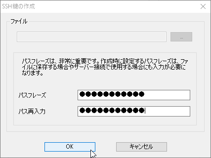

パスフレーズを入力

abridge2019

OK

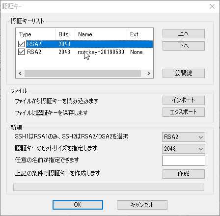

一覧に認証キーができていること。

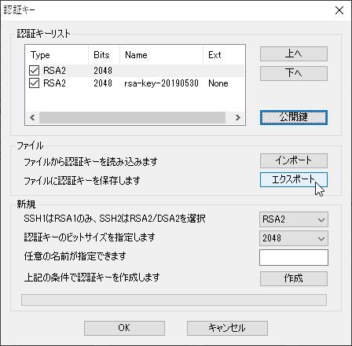

[エクスポート]

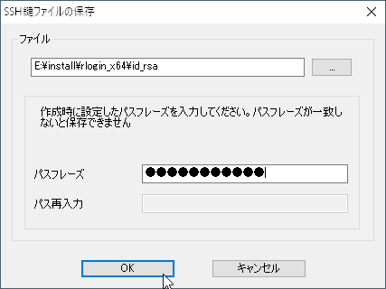

ファイル名をフルパスで指定

ファイル名：id_rsa

abridge2019

OK

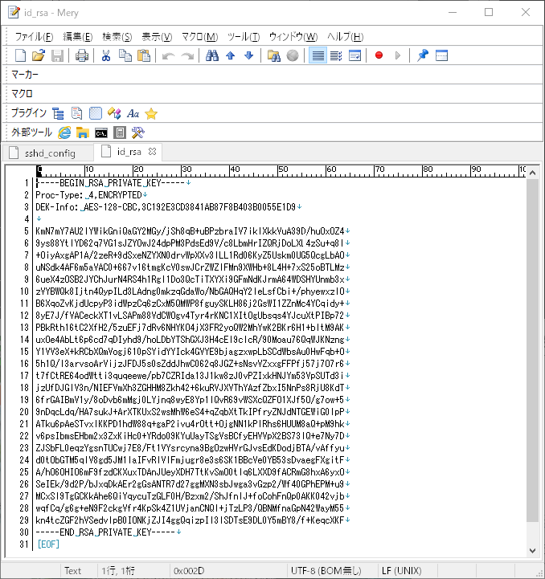

テキストエディタで開いて鍵が出来ていること。

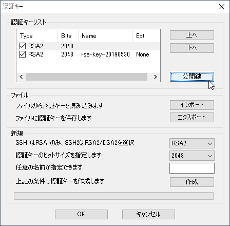

[公開鍵]

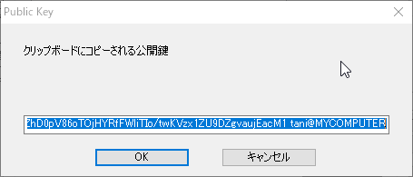

公開鍵をコピペ

ssh-rsa AAAAB3NzaC1yc2EAAAADAQABAAABAQDAx6H0NR7TAdAYDqLeyE9E5u/3SUGv8umG32CxjMZn4R16bWB4kZfVlA6kUrb40m4ZX4Pd0H1PR0SqYxRVfKiz7IjvTpruQ69s6r/4vZphdupMqcu75hzywbLb1EQM6Q++dp2F9P9w5bQzszOYhqczTNVcCNvtYLh1WH9x8uiv8iGSrKfSJPyeX5VcCDyocrm77P//2vx6DSd4CyIM/c3VBK9J9dPXMBmbHw1VHezx5ULXUcv2zVGnWNo4qdjRYnNni0eN2LMOqmOTyynjaBdSffindyItOXQjVR1G33ZhD0pV86oTOjHYRfFWliTIo/twKVzx1ZU9DZgvaujEacM1 tani@MYCOMPUTER

新規でテキストエディタを起動して貼り付けて保存

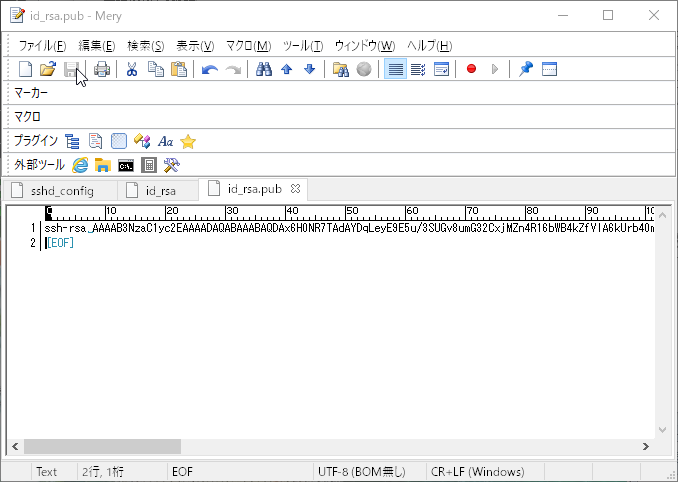

ファイル名： id_rsa.pub

公開鍵をサーバーへアップロード

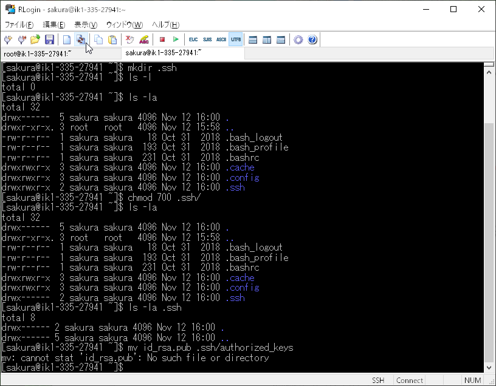

アイコンのファイル転送をクリック

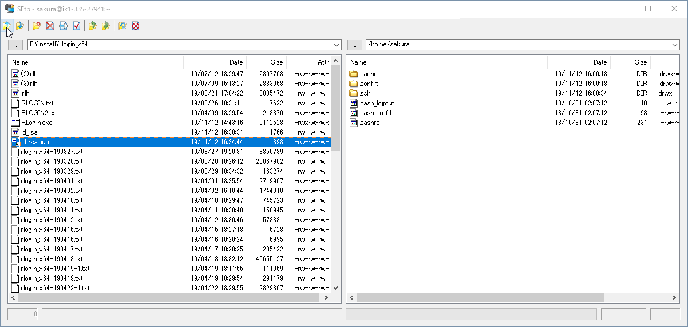

公開鍵ファイル[id_rsa.pub]を選択してアップロードアイコンをクリック

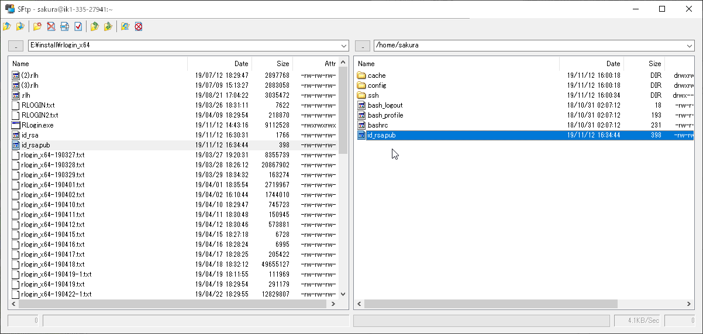

選択したファイルがサーバーに表示されていること

### 公開鍵を使用したSSH接続設定

ディレクトリ移動

cd

ディレクトリ作成

mkdir .ssh

ls -la

.sshディレクトリが出来ていること。

パーミッション変更　自分以外は一切許可しない

chmod 700 .ssh/

ls -la

.sshディレクトリのパーミッションが以下に変更されていること。

drwx------

ls -la .ssh

ファイルがないこと。

ファイルの移動

mv id_rsa.pub .ssh/authorized_keys

ls -la .ssh

以下ファイルがあること。

authorized_keys

パーミッション変更　自分以外は一切許可しない

chmod 600 .ssh/authorized_keys

ls -la .ssh

authorized_keysファイルのパーミッションが以下に変更されていること。

-rw------- 

ls -l /etc/ssh/sshd*

ファイルがあること

バックアップ

sudo cp -p /etc/ssh/sshd_config /etc/ssh/sshd_config.bak1

ls -l /etc/ssh/sshd*

以下ファイルがあること

sshd_config.bak1

修正

sudo vi /etc/ssh/sshd_config

開発用ユーザーパスワードを入力

検索

/PermitRootLogin

n

i

root でのログインを許可するかどうか

PermitRootLogin no

パスワード認証を許可するかどうか

PasswordAuthentication no

保存

Etc

:

wq

sshd再起動

sudo systemctl restart sshd.service

参考

https://vps-news.sakura.ad.jp/tutorials/centos7-initial-settings/

https://help.sakura.ad.jp/206208161/

### 日本語対応

確認

localectl

System Locale: LANG=C　と表示されていること

変更

sudo localectl set-locale LANG=ja_JP.utf8

確認

localectl

System Locale: LANG=ja_JP.utf8　と表示されていること

反映するにはいったんログアウト

exit

参考：https://help.sakura.ad.jp/206376941/

### SSHポート変更

さくらインターネットのパケットフィルタを利用するとポート番号の変更が出来なくなる。

変更する場合はパケットフィルタの設定を無効にすること。

参考： https://vps-news.sakura.ad.jp/vps-pf/

#### ファイアーウォール設定変更

ポート確認

ss -atn

State       Recv-Q Send-Q    Local Address:Port                   Peer Address:Port 

LISTEN      0      128                   *:22                                *:* 

LISTEN      0      100           127.0.0.1:25                                *:*

ESTAB       0      36      153.126.199.195:22                   153.156.175.30:49253 

ESTAB       0      0       153.126.199.195:22                   153.156.175.30:53417              

22番ポートが接続されていること

#### sshd設定変更

## インストール

### リポジトリ更新

OS最新

sudo yum install -y epel-release

Git最新

sudo yum install -y https://centos7.iuscommunity.org/ius-release.rpm

php最新

sudo yum install -y http://rpms.famillecollet.com/enterprise/remi-release-7.rpm

MariaDB最新

curl -sS https://downloads.mariadb.com/MariaDB/mariadb_repo_setup | sudo bash

### Apache

検索(httpsが使用できるようにmod_ssl追加)

yum search httpd

yum search mod_ssl

yum info httpd mod_ssl

インストール

sudo yum install httpd mod_ssl

バージョン等確認出来たら

y

バージョン確認

httpd -v

起動

sudo systemctl start httpd.service

自動起動設定を有効

sudo systemctl enable httpd.service

ポート確認

ss -atn

Local Address:Portの列に*:80と表示されていること

ディレクトリの所有権を変更

sudo chown -R apache:apache /var/www

ディレクトリを所属グループで書き換え可能

sudo chmod -R g+w /var/www

ユーザーグループ追加（WinSCPで開発しやすくするため）

sudo usermod -aG apache sakura

確認

getent group apache

apacheグループにdevelopが所属していること

apache:x:48:develop

設定テスト

httpd -t

再起動

sudo systemctl restart httpd.service

変更したらいったん接続を切って入りなおす

exit

参考:https://teratail.com/questions/30637

### php

検索

yum search --enablerepo=remi,remi-php73 php

yum info --enablerepo=remi,remi-php73 php

yum list php

インストール

sudo yum install --enablerepo=remi,remi-php73 php

バージョンが確認出来たら

y

バージョン確認

php -v

再起動

sudo systemctl restart httpd.service

確認

sudo vim /var/www/html/info.php

i

<?php
phpinfo();
?>

コピペして貼り付け

Esc

:wq

確認

http://153.126.199.195/info.php

phpinfo削除

sudo mv /var/www/html/info.php /var/www/html/info.php.bak

ls -l /var/www/html/

info.php.bakファイルが存在すること

設定

ls -l /etc/php.ini*

sudo cp -p /etc/php.ini /etc/php.ini.org

ls -l /etc/php.ini*

修正

sudo vim /etc/php.ini

このサイトのように

https://www.rem-system.com/centos-httpd-php73/

sudo systemctl restart httpd

systemctl status httpd

 Active: active (running)  と表示されていること。

失敗したときのやり直し

sudo yum remove phpMyAdmin

sudo yum remove php

sudo yum remove php-cli

sudo yum remove php-common

### 

### MariaDB

インストール確認

yum list maria*

Installed Packages
mariadb-libs.x86_64                                   1:5.5.64-1.el7                          @base

既に古いバージョンがインストールされていること

Available Packages
mariadb.x86_64                                        1:5.5.64-1.el7                          base 
バージョンが古いリポジトリしかないこと

アンインストール

sudo yum remove mariadb-libs

確認したら

y

検索

yum list maria*

インストール 大文字小文字を区別する

sudo yum install MariaDB-server MariaDB-client

バージョンが確認出来たら

y

Complete!　とプロンプト画面が表示されていること。

起動

sudo systemctl start mariadb

sudo systemctl enable mariadb

確認

mysql

Server version: 10.4.10-MariaDB MariaDB Server

バージョンが表示されること

MariaDB [(none)]>

上記プロンプトが表示されること

exit

プロンプトが$になること

sudo mysql_secure_installation

※sudoで実行しないと次の手順でrootパスワードを入力してもエラーで先へ進めない

注：このスクリプトのすべての部分を実行することは、本番使用中のすべてのMariaDBサーバーに推奨されます！各ステップを注意深く読んでください！

MariaDBにログインしてセキュリティを確保するには、rootユーザーの現在のパスワードが必要です。
MariaDBをインストールしたばかりで、rootパスワードをまだ設定していない場合、パスワードは空白になるため、ここでEnterキーを押すだけです。

ルートの現在のパスワードを入力します（なしの場合はEnterを入力します）：(rootのパスワードを入力)
OK、パスワードを正常に使用しました。次に進みます...

rootパスワードを設定するか、unix_socketを使用すると、適切な承認なしに誰もMariaDB rootユーザーにログインできなくなります。

ルートアカウントは既に保護されているため、「n」と安全に答えることができます。

unix_socket認証に切り替えます[Y / n]n

...スキップ。

ルートアカウントは既に保護されているため、「n」と安全に答えることができます。

ルートパスワードを設定しますか？ [Y / n] Y
新しいパスワード：jovy2019
新しいパスワードを再入力してください：jovy2019
パスワードが正常に更新されました！
特権テーブルの再読み込み..
 ... 成功！

デフォルトでは、MariaDBインストールには匿名ユーザーが含まれており、ユーザーアカウントを作成しなくても誰でもMariaDBにログインできます。
これはテストのみを目的としており、インストールを少しスムーズにするためのものです。
実稼働環境に移行する前にそれらを削除する必要があります。

匿名ユーザーを削除しますか？ [Y / n] Y
 ... 成功！

通常、ルートは「localhost」からの接続のみを許可する必要があります。
これにより、誰かがネットワークからルートパスワードを推測できないようになります。

リモートでrootログインを許可しませんか？ [Y / n] Y
 ... 成功！

デフォルトでは、MariaDBには「test」という名前のデータベースが付属しており、誰でもアクセスできます。
これもテスト専用であり、本番環境に移行する前に削除する必要があります。

テストデータベースを削除してアクセスしますか？ [Y / n] Y
 -テストデータベースを削除しています...
 ... 成功！
 -テストデータベースの権限を削除しています...
 ... 成功！

特権テーブルをリロードすると、これまでに行われたすべての変更がすぐに有効になります。

今すぐ特権テーブルをリロードしますか？ [Y / n] Y
 ... 成功！

清掃...

全部終わった！上記の手順をすべて完了したら、MariaDBのインストールは安全になります。

MariaDBをご利用いただきありがとうございます！

mysql

MariaDBプロンプトが表示されないことを確認

sudo mysql

MariaDBプロンプトが表示されることを確認

### phpMyAdmin

検索

yum search --enablerepo=remi,remi-php73 phpMyAdmin

yum info --enablerepo=remi,remi-php73 phpMyAdmin

インストール確認

yum list phpMyAdmin

yum list --enablerepo=remi,remi-php73 phpMyAdmin

インストール

sudo yum install phpMyAdmin

sudo yum install --disablerepo=* --enablerepo=epel,remi,remi-php73 phpMyAdmin

※参照リポジトリが増えると依存エラーになりやすくなるので必要なリポジトリのみ有効にする

ディレクトリ移動

cd /etc/httpd/conf.d/

バックアップ

ls -l /etc/httpd/conf.d/phpMyAdmin*

sudo cp -p /etc/httpd/conf.d/phpMyAdmin.conf  /etc/httpd/conf.d/phpMyAdmin.conf.old

ls -l /etc/httpd/conf.d/phpMyAdmin*

phpMyAdmin.conf.oldファイルが出来ていること

修正

sudo vim /etc/httpd/conf.d/phpMyAdmin.conf

このサイトのように

https://knowledge.sakura.ad.jp/9701/

Esc

:wq

sudo systemctl restart httpd

確認

http://153.126.199.195/phpMyAdminY2V8jYfM/

httpで閲覧できないこと

https://153.126.199.195/phpMyAdminY2V8jYfM/

ブラウザ側で信用できないサイトと表示されるが、許可する

httpsで閲覧できること

入力

root

MariaDBで設定したパスワード

でログインできること

失敗したときのやり直し

sudo yum remove phpMyAdmin

sudo yum remove php-common

sudo yum remove php

https://teratail.com/questions/230332

### composer

sudo php -r "copy('https://getcomposer.org/installer', 'composer-setup.php');"

sudo php composer-setup.php

sudo php -r "unlink('composer-setup.php');"

sudo mv composer.phar /usr/local/bin/composer

ls -l /usr/local/bin/composer

composer

バージョンなどが出ていること

### Laravel

cd /var/www

ls -l

sudo mkdir laravel

ls -l

cd laravel

インストール

sudo composer create-project --prefer-dist laravel/laravel=(省略可バージョン番号) (プロジェクト名)

sudo composer create-project --prefer-dist laravel/laravel=5.5 testproject.5.5.clean

sudo composer create-project --prefer-dist laravel/laravel=5.5 testproject.5.5

sudo composer create-project --prefer-dist laravel/laravel=6.0 testproject.6.0

※この時最新版が6.5.1

確認

cd testproject.5.5

php artisan --version

反映

ls -l /etc/httpd/conf/httpd.conf*

sudo cp -p /etc/httpd/conf/httpd.conf /etc/httpd/conf/httpd.conf.org

ls -l /etc/httpd/conf/httpd.conf*

sudo vim /etc/httpd/conf/httpd.conf

DocumentRoot "/var/www/laravel/testproject.6.4/public"

:wq

sudo chown -R apache:apache /var/www/laravel

sudo chmod -R 775 /var/www/laravel

sudo chmod -R 775 /var/www/laravel/testproject.5.5/storage

sudo chmod -R 775 /var/www/laravel/testproject.5.5/bootstrap/cache

再起動

sudo systemctl restart httpd

確認

https://153.126.199.195

以降の直接移動

cd /var/www/laravel/testproject.5.5

### npm(Node.js)

確認

command -v nvm

何も表示されないこと。

nvmインストール

sudo curl -o- https://raw.githubusercontent.com/creationix/nvm/v0.35.2/install.sh | bash

source ~/.bashrc

確認

nvm --version

0.35.2

確認

nvm ls-remote

バージョン一覧が表示されること。

インストール

※この時v10の最新を指定

nvm install --lts=dubnium

確認

nvm current

https://qiita.com/tomy0610/items/6631a04c0e6ea8621b21

https://qiita.com/guai3/items/4d38dcb8a877951b718a

検索

yum search libpng-devel

yum info libpng-devel

インストール確認

※一部のライブラリでlibpng-develを利用しているので、無いとnpm installでエラーになる

yum list libpng-devel

インストール

sudo yum install libpng-devel

確認

node -v

v12.13.0

npm -v

6.12.0

失敗したとき

sudo wget https://raw.githubusercontent.com/laravel/laravel/master/package.json 

sudo npm install

sudo npm install node-sass

sudo npm install --save vue-router

sudo npm install --save-dev cross-env

sudo n stable

ビルド

sudo npm run dev

キャッシュクリア

sudo npm cache clean

sudo mv /var/www/laravel/testproject.5.5/resources/assets/js/app.js /var/www/laravel/testproject.5.5/resources/assets/js/app.js.bak

sudo mv /var/www/laravel/testproject.5.5/resources/assets/js/app.js.org /var/www/laravel/testproject.5.5/resources/assets/js/app.js

ディレクトリごとコピー

cp -pr testproject.5.5.clean testproject.5.5

### Java

インストール (バージョン8)

yum install -y java-1.8.0-openjdk which

確認

which java

以下のディレクトリが表示されていることを確認する。

/usr/bin/java

バージョン確認

java -version

以下の情報が表示されていることを確認する。

OpenJDK 64-Bit Server VM (build 25.265-b01, mixed mode)

## 実装

### 認証

DB作成

https://153.126.199.195/phpMyAdminY2V8jYfM

testmariadb

utf8_general_ci

ls -la

sudo cp -p .env .env.org

sudo vim .env

DB_DATABASE=testmariadb
DB_USERNAME=root
DB_PASSWORD=jovy2019

テーブル作成

sudo php artisan migrate

認証機能生成

sudo php artisan make:auth

### TODOリスト(Vue.js使用)

## GitHub導入

### GitHubでリポジトリ作成

### レンタルサーバーでGitをインストール

バージョン確認

git --version

git version 1.8.3.1

古いバージョンをアンインストール

sudo yum -y remove git

検索

yum search git

yum info git

インストール(httpsが使用できるように追加)

sudo yum install git222

バージョン等確認出来たら

y

バージョン確認

git --version

### レンタルサーバーのリポジトリ上でlaravelプロジェクト作成

確認
cd /var/www/laravel
ls -l

インストール
~~sudo composer create-project --prefer-dist laravel/laravel=5.5 JOINS~~

sudo composer create-project --prefer-dist laravel/laravel=6.0 JOINS

確認
ls -l
cd JOINS
php artisan --version

反映
ls -l /etc/httpd/conf/httpd.conf*
sudo cp -p /etc/httpd/conf/httpd.conf /etc/httpd/conf/httpd.conf.bak
ls -l /etc/httpd/conf/httpd.conf*
sudo vim /etc/httpd/conf/httpd.conf
DocumentRoot "/var/www/laravel/JOINS/public"

:wq

sudo chown -R apache:apache /var/www/laravel
sudo chmod -R 775 /var/www/laravel
sudo chmod -R 775 /var/www/laravel/JOINS/storage
sudo chmod -R 775 /var/www/laravel/JOINS/bootstrap/cache

再起動
sudo systemctl restart httpd

確認
https://153.126.199.195

### レンタルサーバーでGitHubのリポジトリをクローン

確認
cd /var/www/laravel/JOINS

ls -la

空のリポジトリを作成

git init

以下のメッセージが出ること

Initialized empty Git repository in /var/www/laravel/JOINS/.git/

ls -la

.gitファイルが出来ていること

git add --all

※既に.gitignoreファイルが用意されているので、除外対象はあらかじめこのファイルを編集してから実行する

git commit -m "first commit" 
git remote add origin https://github.com/abridgedevelopment/drugstore-web.git

git push -u origin master

core.sparseCheckoutを有効

git config core.sparseCheckout true

GitHubからローカルリポジトリoriginとして読み込む

git remote add origin リポジトリのURL

git remote add origin リポジトリのURL

チェックアウト対象のディレクトリを.git/info/sparse-checkoutに追加

echo 目的のフォルダ > .git/info/sparse-checkout

ローカルリポジトリoriginからリモートリポジトリmasterへpullする

git pull origin master

### レンタルサーバーでpush

### 作業PCでclone

https://github.com/abridgedevelopment/drugstore-web.git

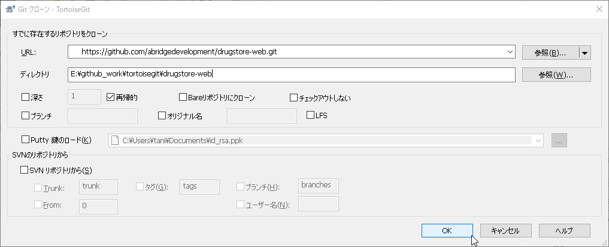

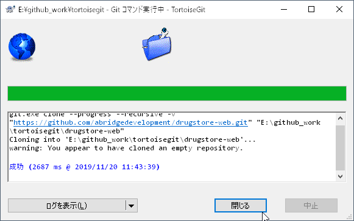

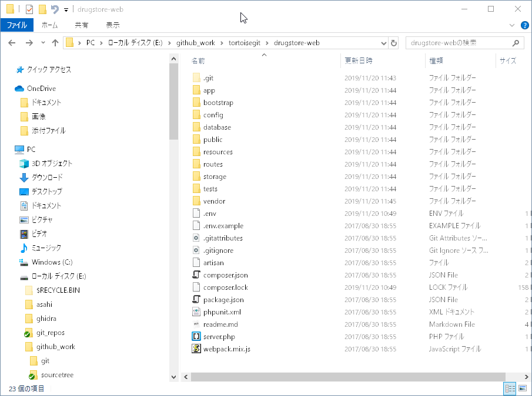

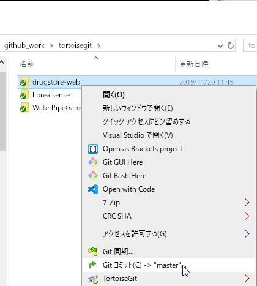

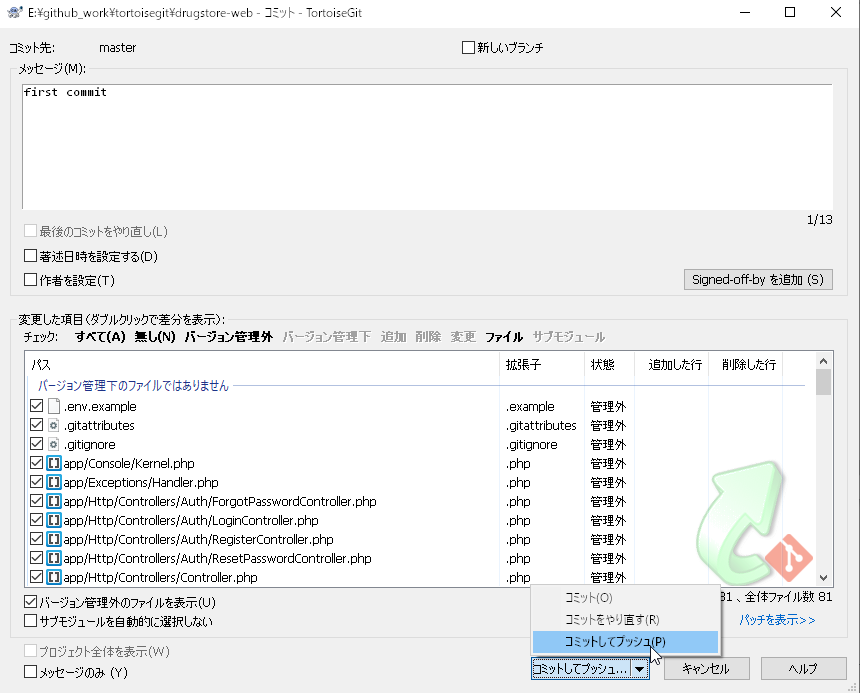

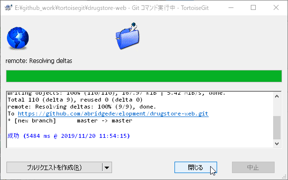

確認

https://github.com/abridgedevelopment/drugstore-web

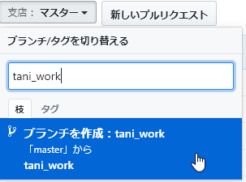

### レンタルサーバーでGitHubのリポジトリをクローン

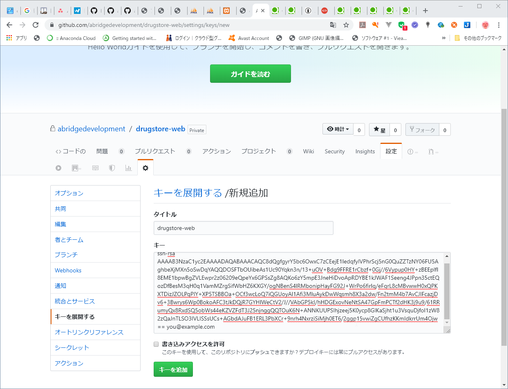

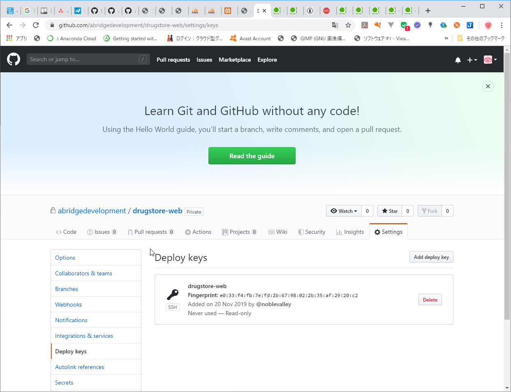

### レンタルサーバーでpull

確認
cd /var/www/laravel/JOINS

ls -la

git pull origin master

git clone https://github.com/abridgedevelopment/drugstore-web.git

### 作業PCで変更ファイルを差し替え

### 作業PCでpush

※web作業用ブランチを作成

## サーバー証明書発行依頼

### 証明書発行依頼書を作成

ディレクトリ移動

cd /etc/pki/tls/certs

依頼書作成

make (ドメイン名).csr

